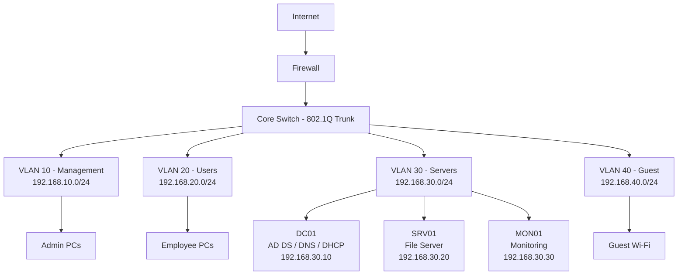

# Διάγραμμα Δικτύου

## Mermaid Diagram

Το GitHub εμφανίζει Mermaid diagrams απευθείας μέσα στο Markdown — αυτό θα εμφανιστεί σαν πραγματικό διάγραμμα στη σελίδα του repository.

## Κανόνες Ροής Κίνησης (Firewall)

| Πηγή | Προορισμός | Επιτρεπόμενα Ports | Σημειώσεις |
|---|---|---|---|
| VLAN 20 (Users) | VLAN 30 (Servers) | 53, 67/68, 88, 389, 445 | Μόνο DNS, DHCP, Kerberos, SMB |
| VLAN 10 (Mgmt) | VLAN 30 (Servers) | 3389, 5985/5986 | RDP + WinRM για διαχείριση |
| VLAN 20 (Users) | VLAN 10 (Mgmt) | Deny all | Οι χρήστες δεν έχουν πρόσβαση στα admin workstations |
| VLAN 40 (Guest) | VLAN 10/20/30 | Deny all | Το guest δίκτυο είναι πλήρως απομονωμένο |
| VLAN 40 (Guest) | Internet | 80, 443 | Πρόσβαση μόνο στο internet για guests |
| Όλα τα VLANs | Internet | 80, 443, 123 | Web + NTP |

## Σημείωση Φυσικού vs Λογικού Δικτύου

Στο lab, όλα τα VM τρέχουν σε ένα μοναδικό hypervisor host χρησιμοποιώντας internal/host-only δίκτυα ανά VLAN, με το firewall VM (π.χ. pfSense/OPNsense ή Windows RRAS) να δρομολογεί και να φιλτράρει την κίνηση μεταξύ τους. Αυτό αναπαριστά τον τρόπο με τον οποίο ένα φυσικό switch + firewall θα διαχώριζε την κίνηση σε παραγωγικό περιβάλλον.
